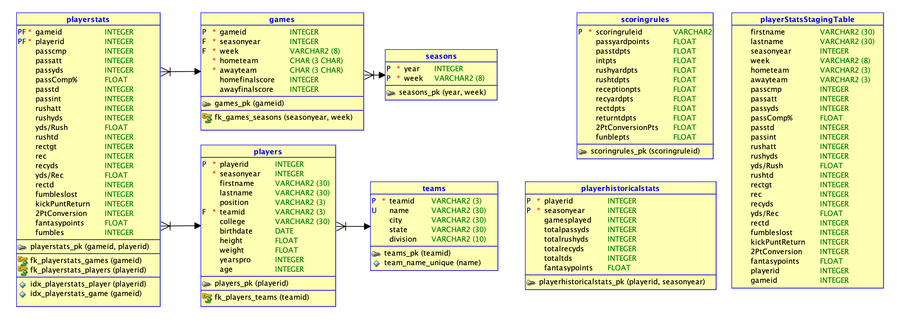

# About Me

I’m Odin Lee, a data scientist from **St. Paul, Minnesota**, with a strong academic background and a passion for turning data into insight.

I'm currently pursuing a **Master of Science in Data Science** at the **University of St. Thomas**, building on my **Bachelor’s degree in Data Science** from **Augsburg University**. Throughout my academic journey, I’ve gained hands-on experience in data analytics, statistical modeling, and programming.

Skilled in **Python**, **SQL**, **R**, **Java**, and **Tableau**, I enjoy transforming complex datasets into clear, actionable insights that drive meaningful outcomes.

***

# Education

  <!-- University of St. Thomas -->
  

    

      <h3 style="margin: 0;">University of St. Thomas</h3>
      
<strong>Master of Science (MS), Data Science</strong> 
      <em>September 2024 – May 2026</em>

    

    
  

  <!-- Augsburg University -->
  

    

      <h3 style="margin: 0;">Augsburg University</h3>
      
<strong>Bachelor of Science (BS), Data Science</strong> 
      <em>January 2019 – May 2024</em>

    

    
  

***

# Projects (most important after About Me)

### Fantasy Football Database
**Tools:** SQL, R  
A structured database designed for fantasy football analytics using cleaned NFL data from the 2021–2023 seasons.  
- Built normalized schemas to enable efficient querying  
- Utilized R for data wrangling and transformation  
- Implemented SQL triggers to maintain data integrity  
- Optimized for future web integration and dashboard development  

[View GitHub Repository](https://github.com/OdinLeePro/FantasyFootballAnalysisDB)

<!-- Add more projects using this format -->
<!--
### Project Title  
**Tools:** Python, Pandas, Tableau  
Brief one- or two-sentence summary of the project's goal, technical approach, and outcome.  
[Link to GitHub/demo](#)
-->

---

# Skills

**Programming Languages:**  
Python | R | SQL | Java  

**Data Visualization:**  
Tableau | Matplotlib | Seaborn | ggplot2 | Plotly | Leaflet  

**Data Wrangling & Analysis:**  
NumPy | Pandas | tidyr | dplyr | tidyverse | stringr  

**Databases & Modeling:**  
Oracle SQL Developer | Oracle Data Modeler
